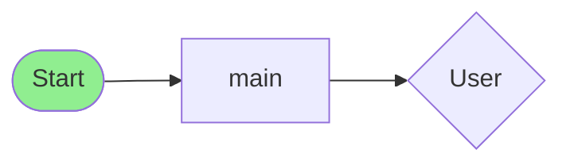

# Flowchart Gen Skill

Auto-generate architecture diagrams from code structure. Transform your codebase into visual flowcharts for documentation, planning, and understanding complex systems.

## Overview

The Flowchart Gen skill analyzes source code and produces various diagram formats including Mermaid, ASCII art, SVG, and React Flow compatible structures. Perfect for visualizing application architecture, understanding code flow, and generating documentation.

## Installation

```javascript
const FlowchartGen = require('./skills/preview/flowchart-gen');
const generator = new FlowchartGen({
  direction: 'LR', // Layout direction
  showDetails: true, // Include method names, line numbers
  maxDepth: 10, // Maximum traversal depth
});
```

## Quick Start

```javascript
const code = `
import React from 'react';
import { useAuth } from './auth';

export function App() {
  return <Dashboard />;
}

function Dashboard() {
  const { user } = useAuth();
  return <UserProfile user={user} />;
}

class UserProfile {
  render() {
    return <div>Profile</div>;
  }
}
`;

const flowchart = generator.generateFlowchart(code);
console.log(flowchart.mermaid);
```

## Features

### Multiple Output Formats

| Format     | Description                          | Use Case               |
| ---------- | ------------------------------------ | ---------------------- |
| Mermaid    | Markdown-compatible flowchart syntax | Documentation, GitHub  |
| ASCII      | Text-based diagram                   | Terminal, logs         |
| SVG        | Vector graphics                      | Web, presentations     |
| React Flow | Interactive node graph               | Web apps, dashboards   |
| JSON       | Structured data                      | API responses, storage |
| YAML       | Human-readable format                | Config files           |

### Code Analysis

Automatically extracts:

- Import statements and dependencies
- Function declarations and calls
- Class definitions and methods
- Module exports
- Dependency relationships

### Layout Options

```
TB (Top-Bottom)    LR (Left-Right)    RL (Right-Left)    BT (Bottom-Top)
    ┌─┐               ┌─┐                 ┌─┐               └─┘
    │A│               │B│──┐             ┌──│B│               ┌─┐
    └┬┘               └──┘┌┘             └┬┬┘──               └┬┘
     │                    │ │              │ │                │
    ┌┴┐                  ┌─┴┴─┐            ┌┴┴┐              ┌┴┐
    │B│                  │ C  │            │B │              │C│
    └─┘                  └────┘            └─┬┘              └─┘
```

## API Reference

### Constructor Options

```javascript
const generator = new FlowchartGen({
  direction: 'LR', // Flowchart layout direction
  showDetails: true, // Include node details (methods, line numbers)
  maxDepth: 10, // Maximum recursion depth for analysis
});
```

### Methods

#### `generateFlowchart(codeStructure, options?)`

Generate complete flowchart from code.

**Parameters:**

- `codeStructure` (string|object): Source code string or pre-parsed structure
- `options` (object, optional): Override defaults

**Returns:**

```javascript
{
  type: 'flowchart',
  timestamp: '2024-01-15T10:30:00.000Z',
  direction: 'LR',
  nodes: [
    { id: 'entry', type: 'start', label: 'Start', shape: 'oval' },
    { id: 'func_main', type: 'process', label: 'main', shape: 'rectangle' }
  ],
  edges: [
    { from: 'entry', to: 'func_main', label: '' }
  ],
  mermaid: 'flowchart LR\n    entry --> func_main...',
  ascii: '┌─────┐\n│Start│\n└─────┘'
}
```

#### `parseCode(code)`

Parse source code into structured format.

**Returns:**

```javascript
{
  imports: ['react', 'axios'],
  exports: ['App', 'Button'],
  functions: [{ name: 'handleClick', line: 42 }],
  classes: [{ name: 'User', methods: ['render', 'update'], line: 10 }],
  dependencies: ['react', 'axios']
}
```

#### `toMermaid(nodes, edges, options?)`

Generate Mermaid flowchart syntax.

**Example Output:**



#### `toAscii(nodes, edges, options?)`

Generate ASCII art diagram.

**Example Output:**

```
      ┌─────────────┐
      │    Start    │
      └──────┬──────┘
             │
      ┌──────▼──────┐
      │    main     │
      └──────┬──────┘
             │
      ◇──────◇
```

#### `toSVG(nodes, edges, options?)`

Generate SVG diagram.

**Parameters:**

- `width` (number): SVG width (default: 800)
- `height` (number): SVG height (default: 600)

#### `toReactFlow(nodes, edges)`

Generate React Flow compatible structure for interactive diagrams.

#### `toJSON(codeStructure, options?)`

Export as JSON string.

#### `toYAML(codeStructure, options?)`

Export as YAML format.

## Examples

### Simple Function Flow

```javascript
const code = `
function calculateTotal(items) {
  return items.reduce((sum, item) => sum + item.price, 0);
}

function applyDiscount(total) {
  return total * 0.9;
}

function checkout(items) {
  const total = calculateTotal(items);
  return applyDiscount(total);
}
`;

const result = generator.generateFlowchart(code);
console.log(result.ascii);
```

### Class Architecture

```javascript
const code = `
class UserService {
  async getUser(id) {
    return await fetch(\`/api/users/\${id}\`);
  }
  
  async updateUser(id, data) {
    return await fetch(\`/api/users/\${id}\`, {
      method: 'PUT',
      body: JSON.stringify(data)
    });
  }
}

class AuthService extends UserService {
  async login(credentials) {
    return this.getUser(credentials.userId);
  }
}
`;

const result = generator.generateFlowchart(code);
console.log(result.mermaid);
```

### Generate Mermaid for README

```javascript
const fs = require('fs');

const sourceFiles = ['./src/services/*.js', './src/components/*.js'];
const allCode = sourceFiles.map(f => fs.readFileSync(f, 'utf8')).join('\n');

const flowchart = generator.generateFlowchart(allCode, { direction: 'LR' });
const readme = fs.readFileSync('README.md', 'utf8');

// Insert mermaid diagram
const updatedReadme = readme.replace(
  '<!-- FLOWCHART -->',
  `\`\`\`mermaid\n${flowchart.mermaid}\n\`\`\``
);
```

### Interactive React Flow

```javascript
const FlowchartGen = require('./flowchart-gen');
const { ReactFlowProvider, Controls, Background } = require('reactflow');

function Diagram({ code }) {
  const generator = new FlowchartGen();
  const { nodes, edges } = generator.toReactFlow(
    generator.extractNodes(generator.parseCode(code)),
    generator.extractEdges(generator.parseCode(code))
  );

  return (
    <ReactFlowProvider>
      <Controls />
      <Background />
      <ReactFlow nodes={nodes} edges={edges} />
    </ReactFlowProvider>
  );
}
```

### Export SVG for Documentation

```javascript
const fs = require('fs');

const code = fs.readFileSync('./src/index.js', 'utf8');
const generator = new FlowchartGen();

const structure = generator.parseCode(code);
const svg = generator.toSVG(generator.extractNodes(structure), generator.extractEdges(structure), {
  width: 1200,
  height: 800,
});

fs.writeFileSync('architecture.svg', svg);
```

## Node Types

| Type       | Shape     | Description                 |
| ---------- | --------- | --------------------------- |
| `start`    | Oval      | Entry point of application  |
| `end`      | Oval      | Exit point                  |
| `process`  | Rectangle | Functions, classes, modules |
| `external` | Diamond   | External dependencies       |
| `decision` | Diamond   | Conditional branches        |

## Styling

### Mermaid Styling

```javascript
const flowchart = generator.generateFlowchart(code);
// Custom styles in mermaid output:
style entry fill:#90EE90,stroke:#228B22
style exit fill:#FFB6C1,stroke:#DC143C
```

### Custom Colors

```javascript
const generator = new FlowchartGen({
  nodeColors: {
    start: '#90EE90',
    end: '#FFB6C1',
    process: '#E6E6FA',
    external: '#FFE4B5',
  },
});
```

## Integration

### With Documentation Tools

````javascript
// Generate for Docusaurus, GitBook, etc.
const mermaid = generator.toMermaid(nodes, edges);
// Insert into markdown with ```mermaid block
````

### With Code Review

```javascript
// Generate flowchart on PR
app.post('/webhooks/github', (req, res) => {
  const { pull_request } = req.body;
  const diff = pull_request.diff;
  const flowchart = generator.generateFlowchart(diff);
  // Post to PR description
});
```

### CI/CD Integration

```javascript
// Generate architecture diagrams on build
const code = fs.readFileSync('./src/**/*.js', 'utf8');
const diagram = generator.toSVG(...);

// Upload to S3, include in build artifacts
```

## Best Practices

1. **Use clear naming**: Flowchart clarity depends on code naming conventions
2. **Limit complexity**: Break large codebases into smaller, focused diagrams
3. **Choose appropriate direction**: LR works well for wide diagrams, TB for tall
4. **Include only relevant code**: Filter out boilerplate for cleaner output

## License

MIT
